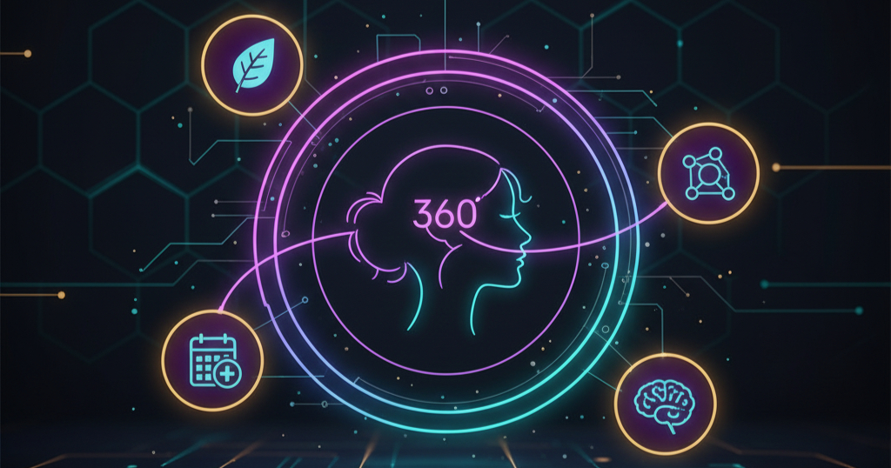
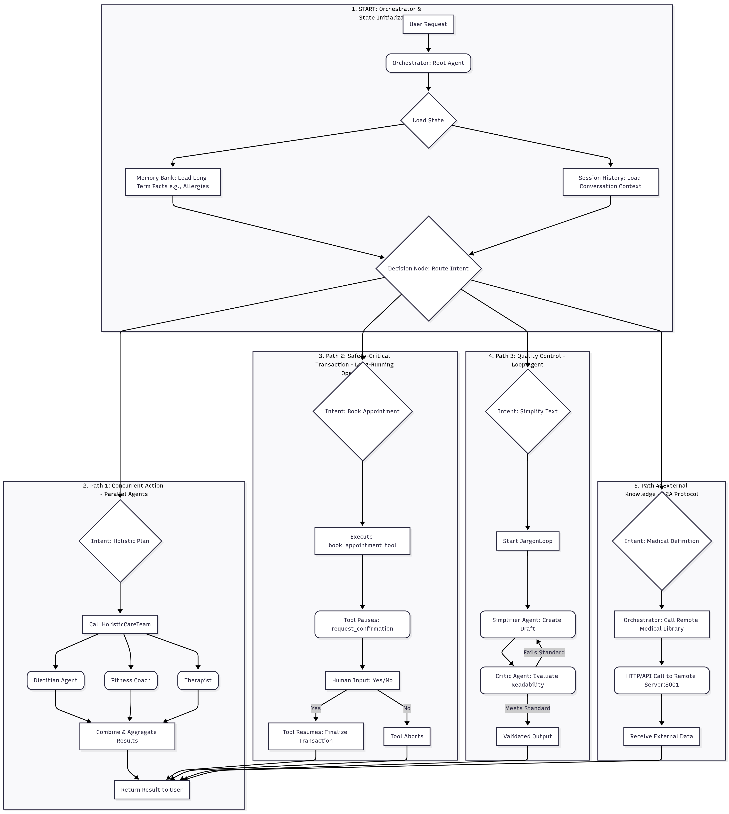

# **🏥 FemHealth 360: A Multi-Agent System for Personalized Women's Healthcare**



## **🌟 Project Overview**

**FemHealth 360** is a concierge AI agent system built using the **Google Agent Development Kit (ADK)** for the Kaggle Capstone Project. It is designed to provide comprehensive, holistic, and safe support for women managing chronic conditions (like PCOS or Endometriosis).

This system demonstrates mastery of advanced agent patterns, including **Parallel Execution, Loop Agents, A2A Communication, Long-Running Operations (Human-in-the-Loop), and Persistent Memory.**

## **💡 Problem & Agent Justification**

### **The Problem**

Managing complex health requires synthesizing information across multiple specialties (diet, fitness, endocrinology) and ensuring safety protocols (allergies, medication interactions). A standard chatbot is **stateless** and prone to unsafe advice or fragmented information.

### **Why Agents?**

Agents provide the necessary **Orchestration, Statefulness, and Safety:**

* **Speed & Holistic View:** **Parallel Agents** run simultaneously to deliver a 360-degree care plan instantly.  
* **Safety & Compliance:** A **Long-Running Operation** enforces human approval before critical actions (like booking appointments) are finalized.  
* **Personalization:** The **Memory Bank** extracts and remembers key facts (allergies, cycle dates) across sessions, preventing dangerous advice.

## **🏛️ System Architecture and Key Features**

The core architecture is a **Hierarchical Multi-Agent System** managed by a single orchestrator.



| ADK Concept | Implementation in FemHealth 360 | Description & File |
| :---- | :---- | :---- |
| **Parallel Agents** | HolisticCareTeam | Runs DietitianAgent, FitnessCoach, and Therapist concurrently for instant, integrated advice. **(agents.py)** |
| **Loop Agents** | JargonLoop | Self-correcting loop using a Simplifier and a Critic to ensure complex medical jargon is always simplified for readability. **(agents.py)** |
| **A2A Protocol** | Remote Medical Library | Communicates with an external, trusted agent running on localhost:8001 (simulating a remote service vendor). **(remote\_server.py)** |
| **Long-Running Operation** | book\_appointment\_tool | Pauses execution using tool\_context.request\_confirmation() to require user approval for a $50 deposit before resuming. **(tools.py)** |
| **Long-Term Memory** | InMemoryMemoryService | Extracts and preloads key user facts (e.g., "I am vegan") into the agent's context for consistent personalization and safety. **(main.py)** |
| **Sessions & State** | DatabaseSessionService | Persists conversation history to a local SQLite database, allowing the user to quit and resume without losing context. **(main.py)** |
| **Observability** | LoggingPlugin | Enabled in main.py to provide detailed traces of tool calls, parallel executions, and decision-making for debugging and monitoring. **(main.py)** |

## **🚀 Setup & Installation Instructions**

### **Prerequisites**

1. **Python 3.10+**  
2. A valid **Google AI API Key**.

### **Step 1: Clone the Repository**
```
git clone [REPO_URL]  
cd FemHealth-360
```
### **Step 2: Install Dependencies**

```
# Installs ADK, uvicorn (for A2A server), and any other required libraries 
pip install -r requirements.txt
```
*(Note: A `requirements.txt` file must be included in the repository.)*

### **Step 3: Set Your API Key**

Create a file named .env in the root directory and add your key:
```
GOOGLE_API_KEY=your_actual_api_key_here
```
### **Step 4: Start the Remote A2A Server**

Open **Terminal 1**. This server simulates a dedicated, remote medical information vendor.
```
python remote_server.py
```
*Expected Output: Uvicorn running on http://localhost:8001*

### **Step 5: Start the Main Application**

Open **Terminal 2** and run the main concierge agent.
```
python main.py
```
*Expected Output: 🏥 FemHealth 360 initialized*

## **🧪 Key Test Scenarios (QA Playbook)**

Use the following inputs in **Terminal 2** to verify all key architectural features are functioning correctly.

| Scenario | Input Command | Expected Verification | ADK Concept Tested |
| :---- | :---- | :---- | :---- |
| **1\. Parallel Execution** | I have PCOS. Give me a holistic plan. | Verify the output is a **combined plan** covering diet, fitness, and therapy, indicating simultaneous execution in the logs. | Parallel Agents |
| **2\. Human-in-the-Loop** | Book an appointment with Dr. Sarah for 2 PM. | Agent pauses, prints: ⚠️ SYSTEM: Booking requires approval... Do you approve?, and only proceeds when you type yes. | Long-Running Operation |
| **3\. A2A Communication** | Define the medical term 'Dysmenorrhea'. | Check **Terminal 1** (remote\_server.py) for a log entry confirming a request was received and fulfilled by the remote agent. | A2A Protocol |
| **4\. Loop Agent** | Explain the complex pathophysiology of Endometriosis. | The agent output must be very simple and use analogies, confirming the Critic and Simplifier agents successfully iterated. | Loop Agents |
| **5\. Persistent Memory** | **Turn 1:** I am strictly vegan. **Turn 2 (after restart):** Suggest a high-protein breakfast. | Agent suggests a **vegan** breakfast (e.g., Tofu scramble), proving the memory fact survived the restart. | Long-Term Memory |

## **☁️ Deployment & Future Work**

### **Deployment Readiness (Bonus)**

The project is built for production deployment. Using the ADK CLI, the system is ready to be deployed to **Vertex AI Agent Engine** for scalable, managed execution:

\# Production deployment command (example)  
adk deploy \--runtime vertex-ai-agent-engine \--project-id \[YOUR\_PROJECT\_ID\] \--agent-name femhealth-360

### **Future Enhancements**

* **Vector Database Integration:** Migrate from InMemoryMemoryService to a cloud-based Vector DB for enhanced memory scaling and semantic search.  
* **Live API Integration:** Replace the mock booking tool with an actual third-party scheduling API (e.g., Calendly API) for true end-to-end functionality.  
* **Proactive Monitoring:** Implement custom metrics plugins (Day 4b) to monitor the performance of individual sub-agents and track the success rate of the Human-in-the-Loop flow.